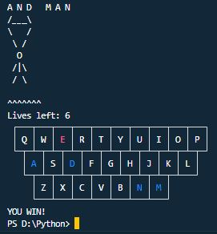
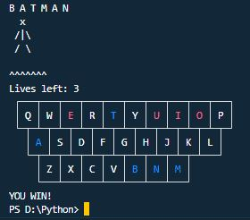
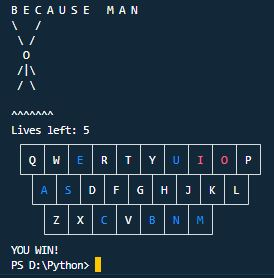
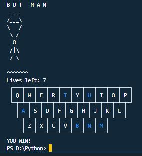
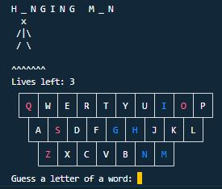
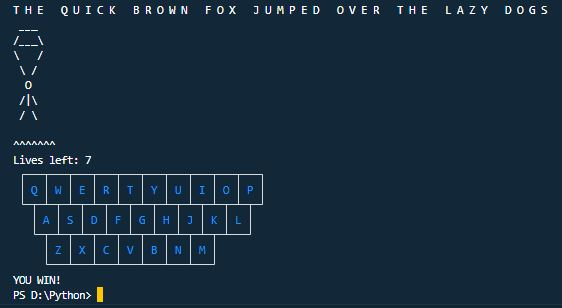
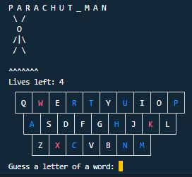

# Jumper
Jumper is a game in which the player seeks to solve a puzzle by guessing the letters of a secret word one at a time. If you ever played hangman, it's the same but in the Jay way.

---
## Images








## Getting Started
Make sure you have Python 3.8.0 or newer installed and running on your machine. Open a terminal and browse to the project's root folder. Start the program by running the following command.
```
python3 seeker 
```
You can also run the program from an IDE like Visual Studio Code. Start your IDE and open the project folder. Select the main module inside the hunter folder and click the "run" icon.

## Project Structure
The project files and folders are organized as follows:
```
root                    (project root folder)
+-- seeker              (source code for game)
  +-- game              (specific classes)
  +-- __main__.py       (program entry point)
+-- README.md           (general info)
```

## Required Technologies
* Python 3.8.0

## Authors
* Jayser Pilapil
